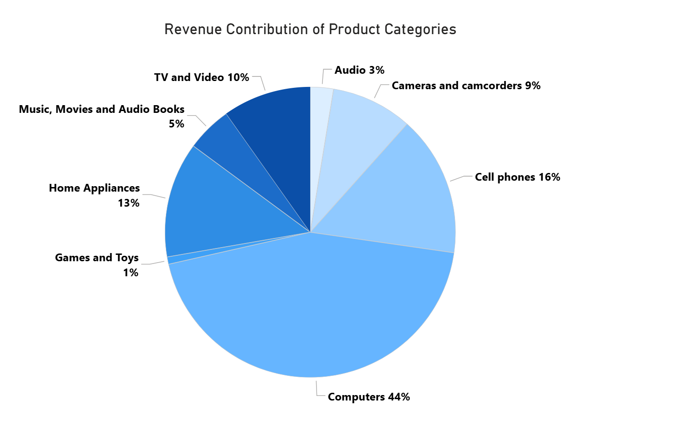
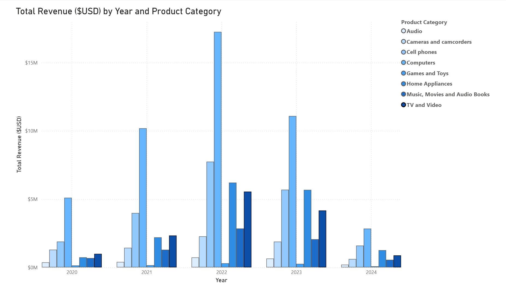

# 📊 Product Category Revenue Contribution Analysis

This analysis examines how different product categories contribute to overall business revenue and how category performance changes across years.

---

# 1️⃣ Overall Revenue Contribution by Product Category

## Key Insights
- **Computers** dominates overall revenue contribution, accounting for nearly half of total revenue.
- **Cell phones** and **Home Appliances** form the second-largest revenue contributors.
- **Games and Toys** contributes minimally to total revenue.
- Revenue contribution is highly uneven across categories, showing strong concentration in a few major segments.

## Business Interpretation
- The business is heavily dependent on the Computers category for revenue generation.
- Smaller categories currently have limited strategic impact on total business performance.
- Revenue diversification opportunities may exist in underperforming categories.

---

# 2️⃣ Yearly Revenue Trend by Product Category

## Key Insights
- Most categories experience strong growth from 2020 to 2022.
- Revenue declines become visible across categories after 2022.
- **Computers** consistently remains the top-performing category each year.
- Mid-tier categories like **Cell phones**, **Home Appliances**, and **TV and Video** show similar growth and decline patterns.
- 2024 values are lower because the dataset only contains data until April 2024.

## Business Interpretation
- The post-2022 slowdown appears business-wide rather than isolated to specific categories.
- Revenue growth historically depended on a few dominant product categories.
- Similar decline patterns across categories may indicate broader market or operational pressures.
- Long-term business stability may require reducing dependency on top-performing categories.

---

# 📌 Overall Business Conclusion

- Revenue generation is highly concentrated in a limited number of categories.
- Computers remains the primary revenue driver throughout the analysis period.
- A broad slowdown becomes visible after 2022 across nearly all product categories.
- Smaller categories contribute limited revenue and currently have weaker business influence.
- The business may benefit from category diversification and balanced portfolio growth strategies.