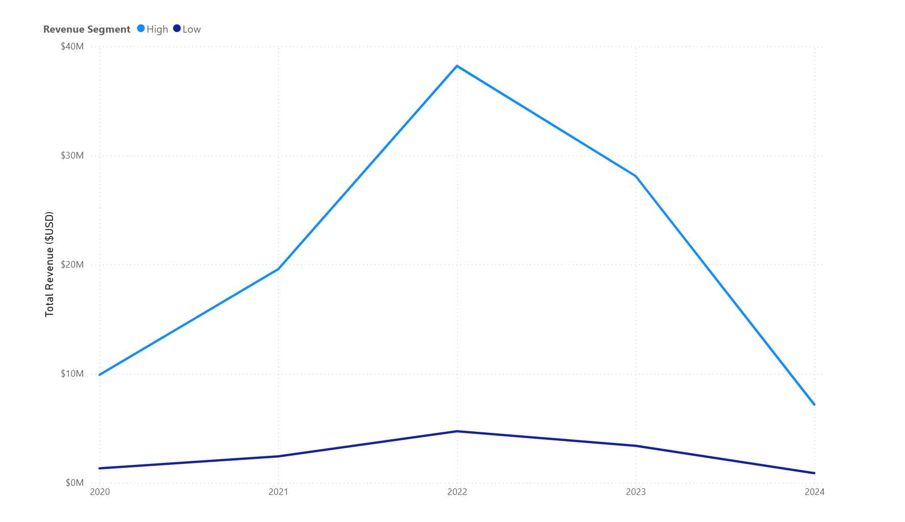
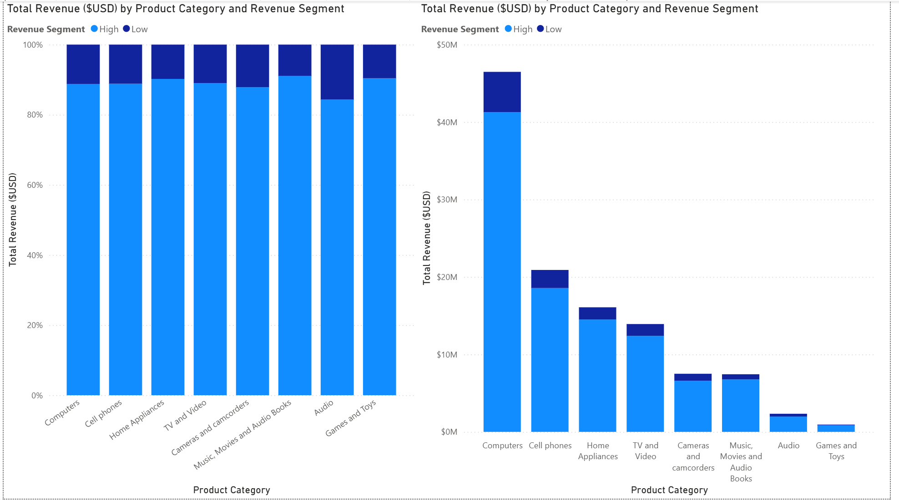
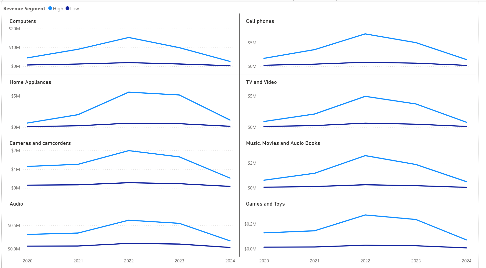

# 📊 Revenue Distribution Analysis

## Overview
This analysis focuses on understanding how revenue is distributed across product categories and revenue segments from 2020 onwards.

Revenue was segmented dynamically using the median revenue value within each product category and year:
- **High Revenue Segment** → revenue above the category-year median
- **Low Revenue Segment** → revenue below the category-year median

The objective of this analysis was to:
- evaluate revenue concentration,
- compare high vs low revenue contribution,
- identify category-level revenue trends,
- and determine whether revenue decline patterns were category-specific or market-wide.

---

# 📈 Overall Revenue Segment Trend

## Key Insights

- Revenue for both high and low segments peaked in **2022**.
- Revenue declined sharply after 2022 across both segments.
- High revenue segments consistently generated the majority of total revenue.
- 2024 values are significantly lower because the dataset only contains records until **April 2024**.

## Business Interpretation

- Revenue decline appears to be broad-based rather than isolated.
- High-value transactions/customers remain the primary revenue drivers.
- The business demonstrates strong dependency on high revenue segments.

---

# 📊 Revenue Contribution by Product Category

## Key Insights

- High revenue segments contribute roughly **85–90%** of total revenue across most categories.
- **Computers** dominates total revenue generation by a large margin.
- **Cell Phones** and **Home Appliances** are the next strongest contributors.
- Smaller categories like **Audio** and **Games & Toys** contribute comparatively little revenue.
- Revenue composition remains relatively stable across categories.

## Business Interpretation

- Business revenue is highly concentrated among top-performing categories.
- Revenue dependency on a few dominant categories increases business concentration risk.
- Low revenue segments provide stable but limited contribution.

---

# 📅 Category-Level Revenue Segment Trends

## Key Insights

- Nearly all categories experienced strong growth until 2022.
- Revenue declined consistently across categories after 2022.
- The trend pattern is similar across categories despite scale differences.
- Separate axis scaling was intentionally used to preserve visibility for smaller categories such as:
  - Audio
  - Games & Toys

## Business Interpretation

- The synchronized decline suggests macro-level business or market slowdown.
- Revenue contraction does not appear isolated to any single category.
- Smaller categories follow similar behavioral patterns despite lower absolute revenue.

---

# 🛠 SQL Logic Used

The analysis was built using:
- Common Table Expressions (CTEs)
- Median-based segmentation using:
  - `PERCENTILE_CONT(0.5)`
- Conditional revenue classification using:
  - `CASE WHEN`
- Category-wise and year-wise aggregations

---

# 📌 Overall Conclusion

The analysis reveals that:
- revenue growth accelerated strongly until 2022,
- revenue contraction after 2022 affected nearly all categories,
- high revenue segments consistently dominate total revenue contribution,
- and a small number of categories drive the majority of overall business revenue.

The findings indicate a business structure heavily dependent on high-performing categories and high-value revenue segments.