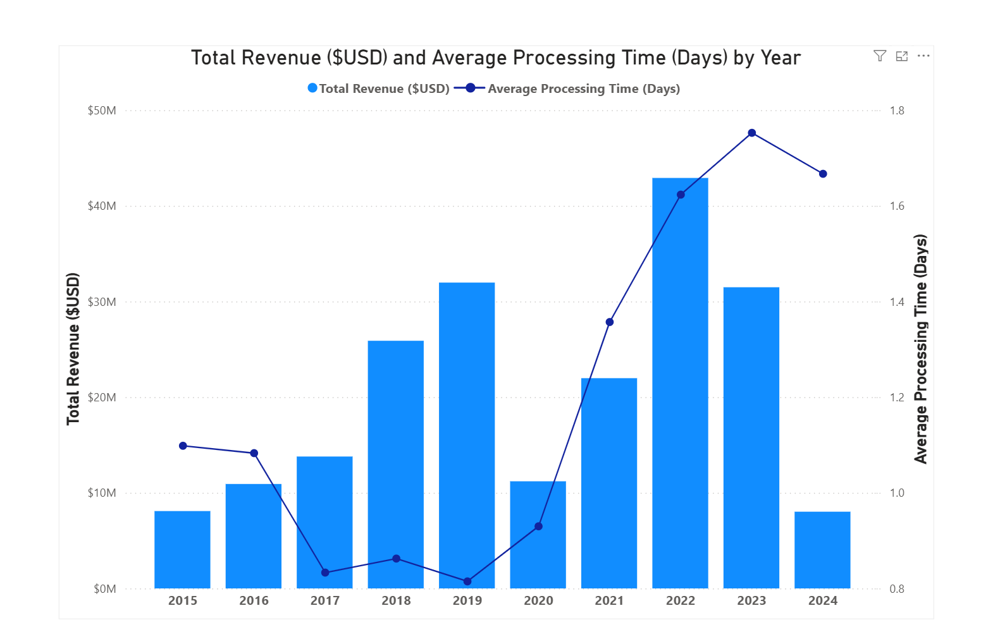

# 📊 Revenue vs Processing Efficiency Analysis

## Key Insights

- Revenue grew consistently between 2015 and 2019 before declining sharply in 2020.
- Strong recovery was observed in 2021–2022, with revenue peaking in 2022.
- Average processing time remained below 1 day until 2020 but increased significantly after 2021.
- 2023 recorded the highest processing time despite lower revenue than 2022.
- 2024 data is partial-year data (till April) and should not be compared directly with previous full years.

## Business Interpretation

- Post-2020 revenue recovery appears to have increased operational pressure on fulfillment processes.
- Rising processing time alongside high revenue suggests scalability or logistics bottlenecks.
- Operational efficiency weakened during peak business growth years.
- The business may need process optimization or supply-chain improvements to sustain growth efficiently.